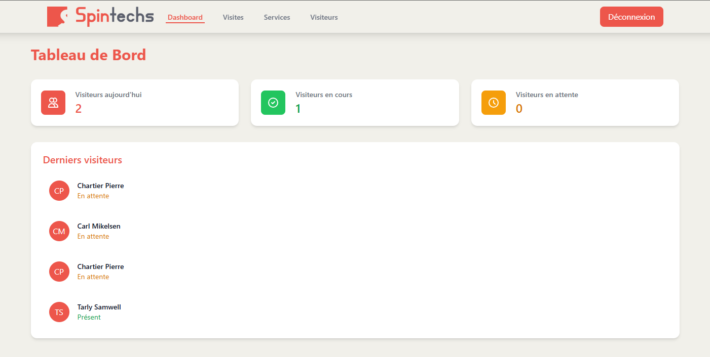
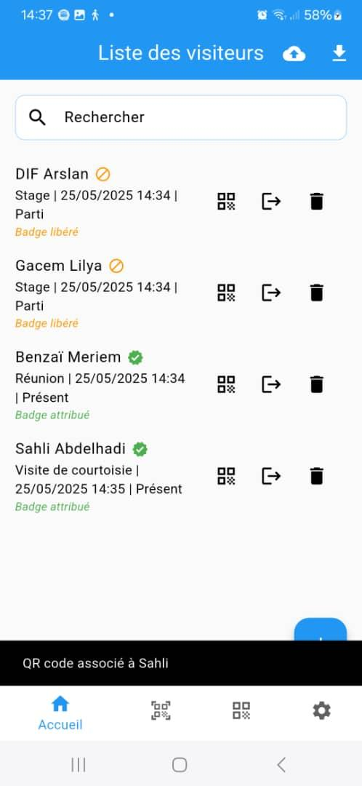
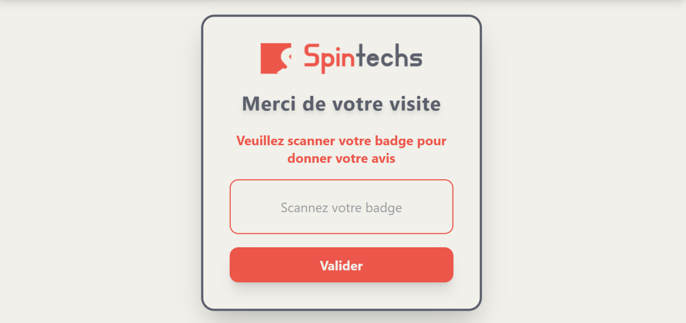
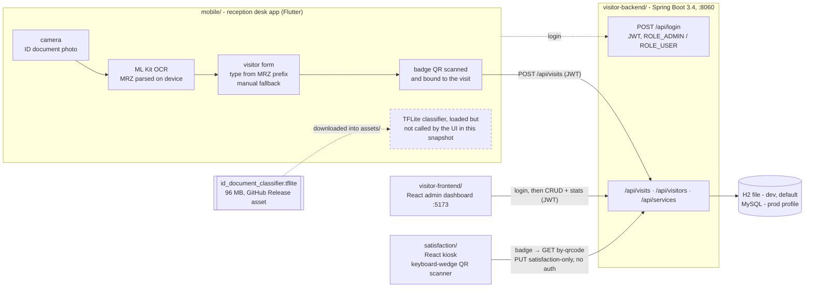

# Visitor Management System (SPINTECHS)

Reception-desk visitor management built by a team of four as a bachelor's capstone
(USTHB, Licence, defended 2025-06-04) hosted by SARL SPINTECHS: a Flutter app that reads the
MRZ of ID documents **on the phone** (ML Kit), a Spring Boot API, a React admin dashboard and a
React satisfaction kiosk keyed on the visitor's badge. A TensorFlow Lite document classifier
ships with the app but is not wired to the UI in this snapshot.

[](https://github.com/D-Arslan/Gestion-des-visiteurs-Spintechs/actions/workflows/ci.yml)

CI checks that the four components build; test coverage is minimal (see Limits).

The four original repositories, gathered as they stood at the end of the project (see
[Provenance](#provenance)). A working prototype, not a product.

## Problem → Result

At the host company, visitors were logged by hand: the receptionist copied the ID document,
nobody had a live view of who was on site, and the visit left no feedback. The prototype covers
the whole visit: photo of the ID document → MRZ read on the phone (document type from the MRZ
prefix, name and number from its fields) → visit record → a pre-printed QR badge bound to the
visit → live counts on the web dashboard → a 1-to-5 rating at the kiosk when the visitor scans
the badge on the way out.



*Admin dashboard (screenshot from the thesis, test data with fictitious names).*

<p>
  
  
</p>

*Mobile visitor list, the four team members used as test visitors (left), and the satisfaction
kiosk at the exit (right). Screenshots from the thesis.*

| item | value | source |
|---|---|---|
| document type in the visit record | read from the MRZ prefix (`IDDZA`, `DLDZA`, `P<DZA`) | `mobile/lib/pages/scan_page.dart` |
| document classifier (shipped, not called) | ResNet50 backbone + dense head, 3 classes (ID card, passport, driving licence) | op names in the `.tflite` graph, `mobile/assets/models/labels.txt` |
| classifier dataset | 233 images of Algerian ID documents, 70/15/15 split, all images of one person in the same split | thesis, §5.1 |
| **classifier test accuracy** | **96.3 %**, model alone | thesis, §5.4 and appendix; **training code not available, not reproducible here** |
| test set size | ≈ 35 images (15 % of 233; 96.3 % is exactly 26/27), so one image is worth 3 to 4 points | **deduced** from the figures above, not stated in the thesis |
| backend tests | 1 test (Spring context loads, `dev` profile), passing | `mvn test`, 2026-10-03, JDK 21 |

The 96.3 % is the thesis's measurement of the model on its own test split. It says nothing
about the app: in this snapshot the scan button runs the MRZ path only (see Limits). The
trained model is shipped; the notebook that produced it is not in this repository.

## Architecture



Static copy: [docs/architecture.svg](docs/architecture.svg). One backend, three clients. The
document photo never leaves the phone: MRZ reading and parsing run on the device, and only the
extracted text fields are sent. The classifier box stands apart on purpose: the model is
loaded when the scan screen opens, but nothing in the UI calls it. The badge links the desk
and the kiosk: "taken" while the visit is open, released when it is closed.

## Stack

| component | tools |
|---|---|
| mobile | Flutter (Dart SDK ^3.7.2), `tflite_flutter` 0.11, `google_mlkit_text_recognition` 0.11, `mobile_scanner` 3.2, Hive (local list), FR / EN / AR |
| backend | Java 21, Spring Boot 3.4.3 (Web, Data JPA, Security), jjwt 0.11.5, springdoc-openapi 2.5 |
| database | H2 file database (`dev`, default), MySQL (`prod` profile) |
| admin dashboard | React 18, Vite 6, Tailwind CSS 3, axios |
| satisfaction kiosk | React 19, Vite 6, Tailwind CSS 3; badge input from a QR scanner acting as a keyboard |
| model | ResNet50 (ImageNet weights) fine-tuned in Keras, exported to TensorFlow Lite (float32, 96 MB) |

## Getting started

Requirements: JDK 21 and a local Maven 3.9 (the Maven wrapper is incomplete), Node 20,
Flutter 3.32 with an Android device or emulator.

```bash
git clone https://github.com/D-Arslan/Gestion-des-visiteurs-Spintechs.git && cd Gestion-des-visiteurs-Spintechs
cd visitor-backend && mvn spring-boot:run          # :8060, H2 file in visitor-backend/data/, Swagger at /swagger-ui.html
cd visitor-frontend && npm ci && npm run dev       # admin dashboard on :5173 (another terminal)
cd satisfaction && npm ci && npm run dev           # satisfaction kiosk on :5174 (another terminal)
```

Log in to the dashboard with **`admin` / `admin`** (or `user` / `user`, read-only). Both accounts
are **demo accounts** created at startup by `DataLoader.java`; change them before any real use.

**Mobile.** The model is not in git; download it into the assets folder first:

```bash
curl -L -o mobile/assets/models/id_document_classifier.tflite \
  https://github.com/D-Arslan/Gestion-des-visiteurs-Spintechs/releases/download/model-v1/id_document_classifier.tflite
# sha256: 7ae0b49a549f5e0b18d97db83fcb980ae9b0fa46a65dfe6f222bd851a4b40a16
cd mobile && flutter pub get
flutter run --dart-define=API_BASE_URL=http://10.0.2.2:8060        # Android emulator (10.0.2.2 = the host)
flutter run --dart-define=API_BASE_URL=http://<PC LAN IP>:8060     # physical phone on the same Wi-Fi
```

Without `--dart-define` the app targets `localhost`, i.e. the phone itself. The `dev` profile
binds the backend to `0.0.0.0`, so a phone on the same network can reach it.

**Configuration.** The backend reads `SPRING_PROFILES_ACTIVE`, `DB_*` and `JWT_SECRET` from the
environment ([.env.example](.env.example)); `JWT_SECRET` falls back to an insecure dev value,
so set it outside local dev. The dashboard reads `VITE_API_URL`
([visitor-frontend/.env.example](visitor-frontend/.env.example)).

## Repository layout

```
Gestion-des-visiteurs-Spintechs/
├── mobile/                      # Flutter reception-desk app
│   ├── lib/pages/               # home (visitor list, exit), scan (MRZ; model loaded, not called), qr_code (badges), login, settings
│   ├── lib/services/            # classifier_helper (TFLite, unused), visiteur_api_service (REST), visiteur_service (Hive)
│   ├── lib/utils/               # constants (API_BASE_URL), translations (FR / EN / AR)
│   └── assets/models/           # labels.txt; the .tflite is downloaded from the Release
├── visitor-backend/             # Spring Boot API, package com.example.gestionvisiteurs
│   └── config/ controller/ …    # SecurityConfig, JwtUtil, DataLoader (demo users); Auth, Visit, Visitor, Service
├── visitor-frontend/            # React admin dashboard (dashboard, visits, services, visitors)
├── satisfaction/                # React kiosk: badge scan, then 1-5 rating
├── docs/                        # DESIGN.md, architecture.svg, images/
├── scripts/export_diagram.py    # README Mermaid → docs/architecture.svg
├── .github/workflows/ci.yml     # build checks: mvn test, flutter analyze, npm run build ×2
└── .env.example
```

## Design decisions and trade-offs

- **Read the document on the phone.** ML Kit OCR and the MRZ parser run on the device: no
  document image is uploaded or stored server-side; only text fields reach the API.
- **MRZ first, then a human.** The MRZ prefix gives the document type and its fields give name
  and number; when the MRZ is not found, the receptionist types the fields instead.
- **Reusable QR badges.** Badges are pre-printed; a badge is bound to a visit at the desk and
  released when the visit is closed, so a badge already in use is refused.
- **The badge is the kiosk's only credential.** No login at the exit: scanning the badge finds
  the open visit and records the rating. Simple for visitors, and the reason two endpoints are
  open (see Limits).
- **Stateless JWT with two roles** for the dashboard and the app; H2 file database by default
  so the backend starts with no setup, MySQL behind a profile.
- **Model out of git**: a 96 MB Release asset with its checksum, not a repository file.

Details, and the reasoning behind each: [docs/DESIGN.md](docs/DESIGN.md).

## Limits and next steps

- **The classifier is not called.** A version with the classifier wired to the scan button
  was demonstrated at the defense (June 2025); that code was not kept, and this repository
  holds the last available snapshot.
- **Two classification code paths, neither called, preprocessing unknown.** `scan_page.dart`
  feeds inputs in [0, 1], `ClassifierHelper` in [-1, 1]; the UI calls neither. The training
  preprocessing is unknown, so it is not known which, if either, matches the model.
- **The 96.3 % cannot be checked here.** The training notebook is not available, and the test
  split is about 35 images, where one image moves the score by 3 to 4 points.
- **No confidence threshold.** Both code paths take the top class, so the model always returns
  one of the three classes, even for an image that is not a document.
- **Open endpoints.** `SecurityConfig` permits `/api/visits/{id}` and `/api/visits/*` for every
  HTTP method without a token: anyone who can reach the API can read, modify or delete a visit.
  Not fixed in this snapshot; the fix is to open only the two kiosk calls, by method.
- **Thin test coverage.** One backend test (context loads); `mobile/test/widget_test.dart`
  does not compile (it was already broken in the original repository); no tests for the two
  React apps.
- **Prototype leftovers**: a debug button, a hard-coded kiosk URL, an incomplete Maven wrapper;
  the full list is in [docs/DESIGN.md §5](docs/DESIGN.md#5-known-debt).

## Team and my contribution

| member | role (as stated in the thesis) |
|---|---|
| **DIF Arslan Aris** | group lead; mobile application (Flutter); took part in model integration and training |
| SAHLI Abdelhadi | backend (Spring Boot) |
| GACEM Sara Lylia | web interfaces: admin dashboard and satisfaction kiosk (React) |
| BENZAÏ Meriem | AI module: dataset, document classifier, MRZ extraction |

**My contribution.** I led the mobile application (Flutter): reception-desk flow, ID-document
capture, QR badge scanning and binding to the visit, FR/EN/AR interface. I wrote the on-device
inference code (TFLite conversion, preprocessing, model call, 3-class decision) and the
fallback to manual entry; in the final version the scan button runs the MRZ path only and the
classifier is not called (see Limits).
I took part in the model work with Meriem, who led it: transfer learning on ResNet50, two-phase
fine-tuning, evaluation on the held-out set. The training notebook is not in this repository;
the shipped .tflite is the artifact that remains. I also coordinated the group and the
integration of the four components with the backend.

### Provenance

One initial commit built from the four original repositories. Commit authorship in those
repositories reflects who pushed, not who wrote (`lilygacem` is GACEM Sara Lylia, `Dashbateman`
is SAHLI Abdelhadi); the roles above come from the thesis.

| folder | original repository | last commit |
|---|---|---|
| `mobile/` | `D-Arslan/gestion_visiteurs_stable_avec_backend` | `4f2731c` (2025-05-31) |
| `visitor-backend/` | `lilygacem/visitor-backend` | `bf7f44e` (2025-05-30) |
| `visitor-frontend/` | `lilygacem/visitor-frontend` | `e8d16ee` (2025-05-28) |
| `satisfaction/` | `lilygacem/satisfaction` | `2992dbf` (2025-05-30) |

Each folder is the final working copy of its repository, uncommitted changes included. The
few changes made for publication (secrets to environment variables, configurable API URLs,
model to a Release asset) are listed in [docs/DESIGN.md §6](docs/DESIGN.md#6-provenance).

## Author

Arslan Dif, M2 distributed systems and data science. Related work:
[UrbanFlow](https://github.com/D-Arslan/UrbanFlow) (real-time Vélib' pipeline, Kafka / Spark /
XGBoost), [TerraOps](https://github.com/D-Arslan/terraops) (MLOps platform with a measured drift
monitor), [TerraOps Copilot](https://github.com/D-Arslan/terraops-copilot) (LLM agent with tools,
evaluated against ground truth), [CROUS Sentinel](https://github.com/D-Arslan/crous-sentinel)
(housing-alert bot and its post-mortem), [Crop Classification](https://github.com/D-Arslan/crop-classification)
(MCTNet reproduction on Sentinel-2 time series).
