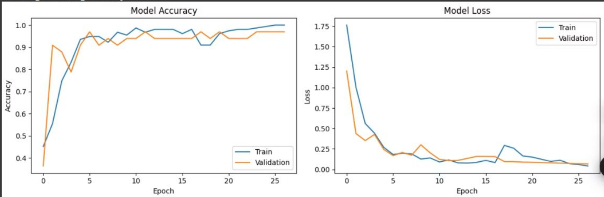

# Visitor Management System — design decisions and limits

The README keeps one line per decision. This file holds the reasoning, what the code actually
does where it differs from the thesis, the classifier as far as it can be checked, the security
notes and the known debt. Every statement points to a file in this repository, to the thesis
(PFE n° 60/2025, USTHB, not versioned here), or says that it is deduced.

## 1. Design decisions, and why

**Read the document on the phone.** The reception desk is a phone, not a scanner. ML Kit text
recognition (`google_mlkit_text_recognition`) runs on the device; the MRZ lines are isolated
and parsed in Dart (`mobile/lib/pages/scan_page.dart`, `_launchMRZRecognition` and
`_extractMRZFields`). No document image is uploaded: the API receives a visit made of text
fields (name, first name, document number, type, reason, service). The thesis says the
backend validates and parses the MRZ with regular expressions (§5.2, appendix); in the code
the parsing happens on the phone and the backend receives the parsed fields. This repository
follows the code.

**MRZ first, then a human.** The parser keeps the OCR lines of at least 20 characters, needs
at least two, and recognises three Algerian layouts by prefix: `IDDZA` (national ID card),
`DLDZA` (driving licence), `P<DZA` (passport). The document type stored with the visit comes
from that prefix. Anything else returns "unrecognised MRZ format", and the receptionist uses
the manual "add a visitor" form (`home_page.dart`, `_ajouterVisiteur`). Manual entry is a
designed path, not an error state: worn cards and glare are common at a desk.

**Reusable QR badges.** Badges are pre-printed QR codes, not generated per visit. At the desk
the app scans a badge and binds its value to the visit (`qr_code_page.dart`); a badge counts as
taken while its visit is not `CLOTURE` (`home_page.dart`, `_verifierBadgeAttribue`), so the
same badge cannot be given twice. At the exit, scanning the badge sets the visit to `CLOTURE`
and frees the badge. The visit states are `EN_ATTENTE`, `PRESENT`, `CLOTURE`.

**The badge is the kiosk's only credential.** The satisfaction kiosk (`satisfaction/`) is a
separate screen at the exit: the visitor scans the badge with a QR scanner that acts as a
keyboard (an auto-focused field, validated on Enter); the kiosk then calls
`GET /api/visits/by-qrcode`, then `GET /api/visits/{id}`, then `PUT /api/visits/{id}/satisfaction-only?satisfaction=1..5` (range checked server-side). No
login on a public screen, so those calls are permitted without a token, which is where the
security debt in §4 comes from.

**Stateless JWT, two roles.** `POST /api/login` returns a token signed with HMAC-SHA; the key
is the SHA-256 of `jwt.secret` (`JwtUtil.java`), so any secret length gives a valid 256-bit key.
Tokens last one hour. `ROLE_ADMIN` and `ROLE_USER` exist; `DataLoader.java` creates the demo
accounts `admin/admin` and `user/user` at startup if they are missing. The dashboard stores the
token in `localStorage` and drops it on 401/403 (`axiosInstance.jsx`).

**A database that needs no setup.** The default profile is `dev`: an H2 file database in
`visitor-backend/data/` (gitignored), created on first run (`ddl-auto=update`). The `prod`
profile switches to MySQL with `DB_URL`, `DB_USERNAME`, `DB_PASSWORD`. Same schema, generated by
Hibernate in both cases; there is no migration tool.

**Configuration from the environment.** For publication, the database password and the JWT
secret were moved out of the sources into `DB_PASSWORD` and `JWT_SECRET`; the dashboard reads
`VITE_API_URL` and the app reads `API_BASE_URL` at build time (`--dart-define`), instead of a
LAN address written 20 times in the Dart code. Defaults keep `dev` usable with no variable set.

**Model out of git.** The `.tflite` is 96 MB, close to GitHub's 100 MB hard limit and well over
its 50 MB warning; it is published as a Release asset with its SHA-256
(`7ae0b49a549f5e0b18d97db83fcb980ae9b0fa46a65dfe6f222bd851a4b40a16`), and the README gives the
download command.

## 2. The document classifier

### What the thesis reports (§5.1, §5.4, appendix)

- 233 photos of Algerian ID cards, passports and driving licences, named
  `<label>_<personID>_<ID>.jpg`, split 70/15/15 **by person**, so that two photos of the same
  document never sit on both sides of the split.
- 224×224 inputs, augmentation (rotation ±10°, shift 20 %, shear 0.2, zoom 20 %, horizontal
  flip).
- ResNet50 with ImageNet weights, head `GlobalAveragePooling2D → Dense(256, ReLU) →
  Dropout(0.3) → Dense(3, softmax)`. Phase 1 trains the head with the backbone frozen (learning
  rate 0.001); phase 2 fine-tunes the last 30 backbone layers (learning rate 1e-5).
  EarlyStopping and ModelCheckpoint. Grid search reported as batch size 16, learning rate
  0.001, dropout 0.3, **15 epochs**.
- **96.3 % accuracy on the test split**, validation loss 0.12; "real-time classification in
  under 2 seconds" (not measured in any file here).

### What the artifact shows

- `id_document_classifier.tflite`, 96 066 116 bytes, float32. Its op names are
  `functional_1/resnet50_1/...` then two dense layers; labels `ID card`, `Passport`,
  `Driving License` (`mobile/assets/models/labels.txt`).
- **Size consistent with the described head** (deduced): ResNet50 without top, batch norm folded
  into the convolution biases, ≈ 23.48 M parameters, plus Dense(2048→256) and Dense(256→3),
  ≈ 0.53 M, gives ≈ 24.0 M float32 parameters ≈ 96.03 MB, against a 96.07 MB file.
- **No normalisation inside the graph**: the input tensor `serving_default_keras_tensor_175`
  goes straight into `resnet50_1/conv1_pad`. Whatever preprocessing training used must be
  repeated exactly by the caller.

### What the app does with it

- `scan_page.dart` loads the model and the labels when the scan screen opens, and enables the
  scan button only once loading succeeded. **The button then runs the MRZ path only.**
  `_launchClassification` in the same file is never referenced, and `ClassifierHelper`
  (`lib/services/classifier_helper.dart`) is never instantiated. This holds in all eight
  commits of the original mobile repository and in its final working copy.
- A version with the classifier wired to the scan button was demonstrated at the defense
  (June 2025); that code was not kept, and this repository holds the last available snapshot.
- **The two unused paths disagree on preprocessing**: `scan_page.dart` divides pixels by 255
  (inputs in [0, 1]), `ClassifierHelper` maps them to [-1, 1] with `(x − 127.5) / 127.5`. A
  ResNet50 trained with Keras' `resnet50.preprocess_input` would expect neither (BGR, ImageNet
  mean subtracted). Without the training notebook it is not known which, if either, matches.
- **No confidence threshold**: both paths take the arg-max of the three scores, so any image,
  document or not, gets a class.

### Training curves

*Screenshot from the thesis, not regenerated (figures 29–30, appendix).*

Observation, without conclusion: the curves span **27 epochs** (0 to 26), while the
hyperparameters in the same appendix declare **15**. The two phases plotted end to end could
explain it (the training loss jumps around epoch 17), but nothing available here confirms it.

### What would make the figure checkable

The notebook (BENZAÏ Meriem led the module), the exact split lists by `personID`, and a
`metrics.json` written by the evaluation. With those, the right preprocessing could be wired
into one code path, a rejection threshold added for non-documents, and the accuracy measured
through the app rather than in the notebook.

## 3. Differences between the thesis and the code

| topic | thesis | code in this repository |
|---|---|---|
| document classification in the app | classification, then OCR | MRZ OCR only; classifier loaded, not called |
| MRZ parsing | backend, regular expressions | phone, `_extractMRZFields` |
| document type | from the classifier | from the MRZ prefix |
| epochs | 15 | curves show 27 (screenshot) |

## 4. Security notes

- **Open endpoints.** `SecurityConfig` permits `/api/visits/by-qrcode`,
  `/api/visits/{id}/satisfaction-only`, `/api/visits/{id}` and `/api/visits/*` **for every HTTP
  method**. The kiosk needs two of them as GET and one as PUT; as written, anyone who reaches
  the API can read, modify or delete any visit by id. Fix: `requestMatchers(HttpMethod.GET,
  "/api/visits/by-qrcode")`, `requestMatchers(HttpMethod.PUT, "/api/visits/*/satisfaction-only")`,
  and nothing else open.
- **CORS** allows any origin pattern with credentials (`addAllowedOriginPattern("*")`).
- **H2 console** is enabled and permitted in `dev` (`/h2-console`).
- **Old secrets.** The original repositories had a hard-coded JWT secret and a MySQL password in
  their sources; both are public in `lilygacem/visitor-backend`. They are not in this
  repository; treat them as compromised and never reuse them.
- **Demo accounts** `admin/admin` and `user/user` are created on every startup if absent.

## 5. Known debt

- Tests: one Spring test (context loads, `dev` profile). `mobile/test/widget_test.dart` does not
  compile (wrong import path, calls a `getText` method that `_HomePageState` does not have); it
  was already broken in the original repository. No tests for the two React apps. CI
  (`.github/workflows/ci.yml`) only checks that the four components build: `mvn test`,
  `flutter analyze lib main.dart` (test/ excluded), `npm run build` for both React apps.
- `flutter analyze` on `lib/` reports 0 errors and 89 infos and warnings (unused fields and
  imports, `print`, `BuildContext` across async gaps), including the unused classifier code.
- `mobile/main.dart` at the root of the Flutter project is an older copy of `lib/main.dart`;
  Flutter ignores it.
- A debug "send to API" button in the visitor list posts a fixed test visitor; the list can be
  exported as JSON from the local Hive box.
- The kiosk calls `http://localhost:8060` directly (no `VITE_API_URL` there).
- `visitor-frontend/src/config/` holds both `axiosInstance.js` and `axiosInstance.jsx`; Vite
  resolves `.js` first, so the `.jsx` copy is dead code (it reads `VITE_API_URL` too).
- `mvnw` / `mvnw.cmd` are versioned but `.mvn/wrapper/` never was: use a local Maven 3.9.
- `pom.xml` keeps `groupId` `com.icosnet` while the code lives in `com.example.gestionvisiteurs`;
  `spring.security.enabled` is not a Spring Boot property and has no effect.
- The dashboard uses React 18 and the kiosk React 19; `html5-qrcode` is a kiosk dependency
  that the code never imports.

## 6. Provenance

| folder | original repository | commits | final state used |
|---|---|---|---|
| `mobile/` | `D-Arslan/gestion_visiteurs_stable_avec_backend` | 8 | `4f2731c` (2025-05-31) + uncommitted changes |
| `visitor-backend/` | `lilygacem/visitor-backend` | 7 | working copy on branch `alt` (`main` = `alt` + merge commit `bf7f44e`) + uncommitted changes |
| `visitor-frontend/` | `lilygacem/visitor-frontend` | 7 | `e8d16ee` (2025-05-28) + uncommitted changes |
| `satisfaction/` | `lilygacem/satisfaction` | 5 | `2992dbf` (2025-05-30) + uncommitted changes |

Commit authorship there reflects who pushed, not who wrote (`lilygacem` is GACEM Sara Lylia,
`Dashbateman` is SAHLI Abdelhadi); the team roles in the README come
from the thesis. Left out on purpose: build outputs and generated Flutter files, `node_modules`,
the H2 database files, `visitor-frontend/.env`, `visitor-backend/README.pdf` (an export of the
backend README on an unrelated template), the model (Release asset) and the thesis PDF.

Changes made in 2026 for this publication, and nothing else: environment variables for the
database password and the JWT secret (`JwtUtil` takes `jwt.secret` by injection), `dev` as the
default profile, `VITE_API_URL` read by the dashboard, `API_BASE_URL` constant in the app
(20 hard-coded URLs replaced), the Spring test moved to the application's package, an editor
lock file removed, root `.gitignore` and `.env.example` files added.
